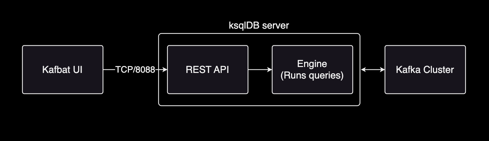

# Integrating ksqlDB with Kafbat UI

## Summary

This document provides configuration details for integrating ksqlDB with Kafbat UI.

Using Kafbat, you can easily integrate [ksqlDB](https://github.com/confluentinc/ksql) with Kafbat UI. This provides a powerful tool for visualizing and managing real-time streaming data.



[ksqlDB](https://github.com/confluentinc/ksql) is a SQL engine based on Kafka Streams. ksqlDB provides a query layer that allows you to build event streaming applications on Kafka topics. Unlike Kafka Streams, ksqlDB allows you to create new streams or materialized views using SQL.

## Configuration

The ksqlDB configuration requires the following basic settings to access the ksqlDB server from Kafbat UI:

```yaml
ksqldbServer: http://my-ksql.data.svc.cluster.local:8088  # ksqlDB server URL
ksqldbServerSsl:                                          # SSL settings (optional)
  keystoreLocation: /path/to/keystore.jks
  keystorePassword: changeit
ksqldbServerAuth:                                         # Auth settings (optional)
  username: ksql_user
  password: ksql_password
```

You can apply this configuration to Kafbat UI in two ways:

1. **Using Docker Compose** (Recommended for local development)
   - Set these values as environment variables in your docker-compose.yml
   - See the example in the "Environment Variables" section below

2. **Using Helm** (For Kubernetes deployments)
   - Add these values in the `yamlApplicationConfig` section of your values.yaml
   - See the example in the "Helm" section below

### Docker Compose

If you are using docker compose, you can set the environment variables in your docker-compose.yml file to configure ksqlDB.

```bash
version: '2'
services:
  kafbat-ui:
    container_name: kafbat-ui
    image: ghcr.io/kafbat/kafka-ui:latest
    ports:
      - 8080:8080
    environment:
      - KAFKA_CLUSTERS_0_KSQLDBSERVER=http://my-ksql.data.svc.cluster.local:8088
      - KAFKA_CLUSTERS_0_KSQLDBSERVERSSL_KEYSTORELOCATION=/etc/security/ksql/keystore.jks
      - KAFKA_CLUSTERS_0_KSQLDBSERVERSSL_KEYSTOREPASSWORD=changeit
      - KAFKA_CLUSTERS_0_KSQLDBSERVERAUTH_USERNAME=ksql_user
      - KAFKA_CLUSTERS_0_KSQLDBSERVERAUTH_PASSWORD=ksql_password
```

### Helm

ksqlDB configuration is specified in `yamlApplicationConfig` section of `values.yaml` file.

```yaml
# charts/kafka-ui/values.yaml
yamlApplicationConfig:
  kafka:
    clusters:
      - name: my-kafka-cluster
        # ... omitted for brevity ...
        ksqldbServer: http://my-ksql.data.svc.cluster.local:8088
        ksqldbServerSsl:
          keystoreLocation: <KEYSTORE_LOCATION>
          keystorePassword: <KEYSTORE_PASSWORD>
        ksqldbServerAuth:
          username: <USERNAME>
          password: <PASSWORD>
```

This table outlines the configuration keys needed to set up ksqlDB with Kafka UI, including their types, example values, and descriptions for proper environment configuration.

| Configuration Key | Type | Example Value | Description |
|-------------------|------|---------------|-------------|
| `kafka.clusters.ksqldbServer` | `string` | `http://my-ksql.data.svc.cluster.local:8088` | URL for the KSQL server, used to connect to the KSQL endpoint.|
| `kafka.clusters.ksqldbServerSsl.keystoreLocation` | `string` | `/etc/security/ksql/keystore.jks` | Path to the keystore file for SSL connection to the KSQL server.|
| `kafka.clusters.ksqldbServerSsl.keystorePassword` | `string` | `changeit` | Password for the keystore file, used for SSL authentication. |
| `kafka.clusters.ksqldbServerAuth.username` | `string` | `ksql_user` | Username for authenticating with the KSQL server. |
| `kafka.clusters.ksqldbServerAuth.password` | `string` | `ksql_password` | Password for authenticating with the KSQL server. |

For detailed schema structure of `yamlApplicationConfig` values in kafka-ui chart, refer to the [kafbat-ui-api.yaml](https://github.com/kafbat/kafka-ui/blob/main/contract/src/main/resources/swagger/kafbat-ui-api.yaml) file.